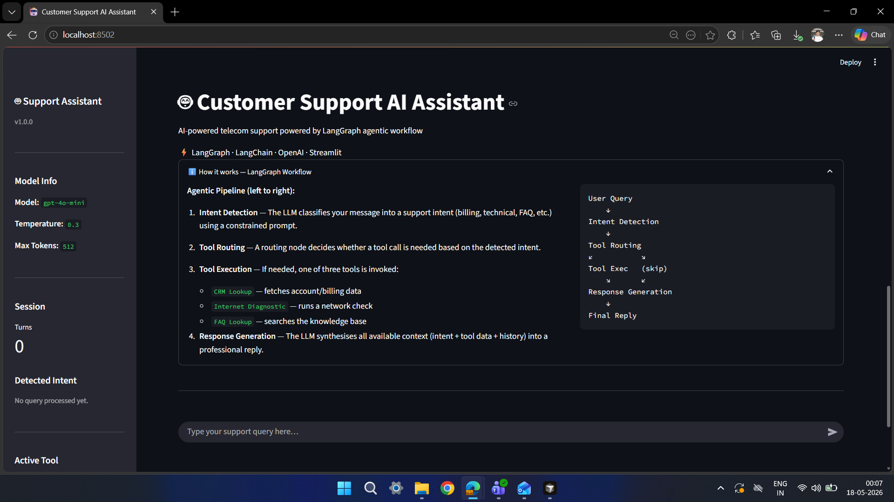

# Customer Support AI Assistant

A production-style LangGraph-powered AI customer support assistant for telecom and enterprise use cases.
Built with LangGraph, LangChain, OpenAI, and Streamlit — demonstrating agentic AI concepts cleanly and professionally.

---

## Project Overview

This project implements an intelligent customer support chatbot that:

- Detects customer intent dynamically using an LLM (no hard-coded if-else logic)
- Routes queries to appropriate tools (CRM, diagnostics, FAQ)
- Generates professional, personalised responses
- Maintains multi-turn conversational context
- Exposes a clean Streamlit chat UI suitable for demos and evaluations

The architecture follows a **LangGraph state machine** pattern — each processing stage is an isolated, testable node in a directed graph, connected by typed state and conditional edges.

---

## Architecture Diagram

```
┌─────────────────────────────────────────────────────────────────┐
│                    Streamlit Frontend (UI)                      │
│         Chat UI · Sidebar · Status Panel · Session State        │
└────────────────────────────┬────────────────────────────────────┘
                             │ user_query
                             ▼
┌─────────────────────────────────────────────────────────────────┐
│                      SupportAgent                               │
│              (wraps and invokes the LangGraph)                  │
└────────────────────────────┬────────────────────────────────────┘
                             │
                             ▼
┌─────────────────────────────────────────────────────────────────┐
│                    LangGraph Workflow                           │
│                                                                 │
│   START                                                         │
│     │                                                           │
│     ▼                                                           │
│   [intent_detection_node]  ← LLM classifies intent             │
│     │                                                           │
│     ▼                                                           │
│   [tool_routing_node]      ← decides if tool needed            │
│     │                                                           │
│     ├── needs_tool=True ──► [tool_execution_node]              │
│     │                              │                            │
│     └── needs_tool=False ──────────┤                           │
│                                    ▼                            │
│                       [response_generation_node] ← LLM reply   │
│                                    │                            │
│                                   END                           │
└─────────────────────────────────────────────────────────────────┘
                             │
              ┌──────────────┼──────────────┐
              ▼              ▼              ▼
         [CRM Tool]  [Diagnostic Tool]  [FAQ Tool]
```

---

## LangGraph Workflow

| Node | Responsibility | LLM Used? |
|------|---------------|-----------|
| `intent_detection_node` | Classifies user query into one of 8 intents | Yes |
| `tool_routing_node` | Decides which tool (if any) to invoke | Tier-1: rule-based; Tier-2: LLM |
| `tool_execution_node` | Runs the selected LangChain tool | No |
| `response_generation_node` | Generates final customer-facing reply | Yes |

**Supported Intents:**
`greeting` · `billing_issue` · `technical_issue` · `recharge_issue` · `faq` · `complaint` · `subscription_query` · `unknown`

**Available Tools:**
- `crm_lookup` — simulated CRM account data (balance, plan, payment history)
- `internet_diagnostic` — simulated network diagnostic report
- `faq_lookup` — keyword-matched FAQ knowledge base

---

## Folder Structure

```
customer_support_agent/
│
├── app/
│   ├── agents/
│   │   ├── support_agent.py     # High-level agent wrapper (SupportAgent class)
│   │   ├── prompts.py           # All LLM prompt templates
│   │   └── state.py             # AgentState TypedDict definition
│   │
│   ├── graph/
│   │   ├── assistant_graph.py   # LangGraph StateGraph build & compile
│   │   └── nodes.py             # All four node functions
│   │
│   ├── tools/
│   │   ├── dummy_crm_tool.py    # @tool — CRM account lookup
│   │   ├── internet_diagnostic_tool.py  # @tool — network diagnostics
│   │   └── faq_tool.py          # @tool — FAQ knowledge base
│   │
│   ├── services/
│   │   ├── llm_service.py       # ChatOpenAI singleton + call helpers
│   │   └── intent_service.py    # LLM-driven intent classification
│   │
│   ├── config/
│   │   ├── settings.py          # Pydantic BaseSettings (reads .env)
│   │   └── constants.py         # Intent labels, tool names, display maps
│   │
│   ├── utils/
│   │   ├── logger.py            # Centralised logging setup
│   │   └── helpers.py           # Pure utility functions
│   │
│   └── main.py                  # CLI interactive REPL
│
├── streamlit_app/
│   ├── app.py                   # Main Streamlit entry point
│   ├── components/
│   │   ├── sidebar.py           # Sidebar: model info, intent badge, tools
│   │   ├── chat_window.py       # Chat bubble rendering
│   │   └── status_panel.py      # Graph execution stepper
│   │
│   ├── assets/
│   │   └── styles.css           # Custom CSS
│   │
│   └── utils/
│       └── session_manager.py   # st.session_state abstraction layer
│
├── tests/
│   ├── test_agent.py            # SupportAgent integration tests (mocked graph)
│   ├── test_tools.py            # Tool unit tests (no mocks needed)
│   └── test_graph.py            # Node & graph structure tests
│
├── .env                         # Your actual secrets (git-ignored)
├── .env.example                 # Template — copy to .env
├── requirements.txt
├── README.md
└── run.py                       # Unified launcher (Streamlit or CLI)
```

---

## Installation

### Prerequisites
- Python 3.11 or higher
- An OpenAI API key

### Steps

**1. Clone the repository**

```bash
git clone https://github.com/YOUR_USERNAME/YOUR_REPO_NAME.git
cd YOUR_REPO_NAME
```

**2. Create and activate a virtual environment**

```bash
# Windows
python -m venv venv
venv\Scripts\activate

# macOS / Linux
python -m venv venv
source venv/bin/activate
```

**3. Install dependencies**

```bash
pip install -r requirements.txt
```

---

## Environment Setup

Copy the example env file and add your API key:

```bash
# Windows
copy .env.example .env

# macOS / Linux
cp .env.example .env
```

Edit `.env`:

```env
OPENAI_API_KEY=sk-your-actual-key-here
MODEL_NAME=gpt-4o-mini
TEMPERATURE=0.3
MAX_TOKENS=512
LOG_LEVEL=INFO
```

> **Important:** `.env` is listed in `.gitignore` and will never be committed to the repository. Never share or commit your real API key.

> **Note:** `gpt-4o-mini` is the recommended model — it is fast, cost-effective, and performs well for intent classification and support response generation.

---

## Running the Streamlit App

**Option 1 — Using the unified launcher (recommended):**

```bash
python run.py
```

**Option 2 — Direct Streamlit command:**

```bash
streamlit run streamlit_app/app.py
```

The app opens at `http://localhost:8501` by default.

---

## Running the CLI Mode

```bash
python run.py --cli

# With debug output (shows graph processing steps)
python run.py --cli --debug
```

---

## Running Tests

```bash
# Run all tests
pytest tests/ -v

# Run specific test file
pytest tests/test_tools.py -v
pytest tests/test_graph.py -v
pytest tests/test_agent.py -v
```

> Tests for tools run without mocks (no API key needed).
> Tests for agent and graph mock the LLM so no API key is required.

---

## Example Queries

Try these in the Streamlit chat or CLI:

| Query | Intent | Tool |
|-------|--------|------|
| `"Hello, I need help"` | greeting | none |
| `"What is my current account balance?"` | billing_issue | CRM Lookup |
| `"My internet has been slow since yesterday"` | technical_issue | Internet Diagnostic |
| `"I want to upgrade my subscription plan"` | subscription_query | CRM Lookup |
| `"How do I recharge my account?"` | recharge_issue | CRM Lookup |
| `"I'm getting call drops every evening"` | complaint | CRM Lookup |
| `"What broadband packages do you offer?"` | faq | FAQ Lookup |
| `"How do I reset my router?"` | faq | FAQ Lookup |

---

## Key Design Decisions

### Why LangGraph?
LangGraph makes the agentic workflow explicit and auditable. Each step (intent → routing → tool → response) is a named, logged node. The conditional branching is declared in the graph topology rather than buried in imperative code.

### Why a TypedDict state?
`AgentState` serves as a typed contract between nodes. Each node reads what it needs and returns only what it updates — LangGraph merges partial updates back into the running state. This pattern scales cleanly as the graph grows.

### Why separate the LLM service?
`llm_service.py` owns the single ChatOpenAI instance and all error handling. No other file imports `ChatOpenAI` directly. Swapping to Azure OpenAI, Claude, or a local model requires changing exactly one file.

### Why dummy tools?
The tools are self-contained and return realistic-looking data, making the assistant's responses feel personalised and demonstrating the tool-calling pattern without requiring external infrastructure.

---

## Future Improvements

- [ ] **Vector-based FAQ** — Replace keyword matching with a FAISS/Pinecone semantic search over a large FAQ corpus
- [ ] **Human handoff node** — Add a graph branch that escalates to a live agent when intent is `complaint` with high severity
- [ ] **Customer authentication** — Add a login step to resolve the actual `customer_id` from session context
- [ ] **Azure OpenAI support** — Add an `AzureChatOpenAI` option in `llm_service.py` controlled by an env flag
- [ ] **Streaming responses** — Use `assistant_graph.stream()` + `st.write_stream()` for token-by-token output
- [ ] **Conversation memory** — Integrate LangChain `ConversationSummaryMemory` to compress long histories
- [ ] **Monitoring** — Add LangSmith tracing for production observability
- [ ] **Docker deployment** — Add `Dockerfile` and `docker-compose.yml` for one-command deployment

---

## Screenshots



---

## Tech Stack

| Component | Library |
|-----------|---------|
| Agentic Workflow | LangGraph 0.2+ |
| LLM Orchestration | LangChain 0.2+ |
| LLM | OpenAI GPT-4o-mini |
| Frontend | Streamlit 1.35+ |
| Config & Validation | Pydantic Settings 2.x |
| Environment Variables | python-dotenv |
| Testing | pytest + pytest-asyncio |
| Logging | Python standard library |

---